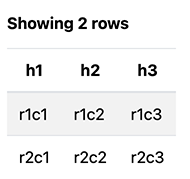
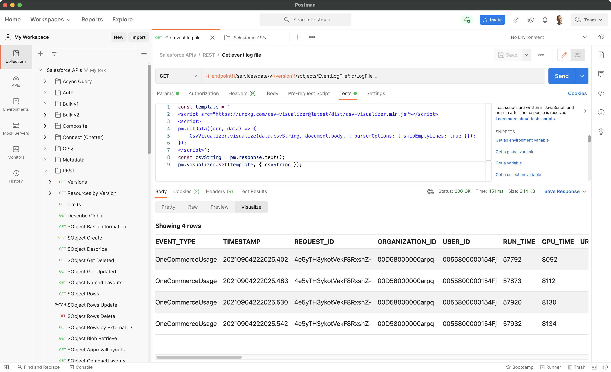

# CSV Visualizer

A visualizer that parses CSV data and renders it in a table in Postman or in a browser.

1. [Example](#example)
1. [Using the Visualizer in Postman](#using-the-visualizer-in-postman)
1. [Reference](#reference)

## Example

The following code...

```html
<script src="https://unpkg.com/csv-visualizer@1.0.0/dist/csv-vizualizer.min.js"></script>
<script>
    const CSV = '"h1","h2","h3"\n"r1c1","r1c2","r1c3"\n"r2c1","r2c2","r2c3"';
    CsvVisualizer.visualize(CSV);
</script>
```

...generates a table like this:



Complete example available in [example.html](example.html).

## Using the Visualizer in Postman

1. Pick a request that returns CSV data
1. Copy the following code in the **Tests** tab:

    ```js
    const template = `<script src="https://unpkg.com/csv-visualizer@latest/dist/csv-visualizer.min.js"></script>
    <script>
    pm.getData((err, data) => {
        CsvVisualizer.visualize(data.csvString);
    });
    </script>`;
    const csvString = pm.response.text();
    pm.visualizer.set(template, { csvString });
    ```

1. Run the request and open the response's **Visualize** tab



## Reference

```js
CsvVisualizer.visualize(
    csvString,
    (rootElement = document.body),
    (options = null)
);
```

`csvString` - the CSV string that holds the table data

`rootElement` - optional, the root DOM element to witch the content is appended. If not specified, `document.body` is used.

`options` - optional, an object that contains the table and parser options:

| Property        | Type      | Default | Description                                                                         |
| --------------- | --------- | ------- | ----------------------------------------------------------------------------------- |
| `showHeader`    | `boolean` | `true`  | Whether the table should have a header that indicates the number of rows.           |
| `parserOptions` | `Object`  | `{}`    | CSV parser options. See [Papa Parse Config](https://www.papaparse.com/docs#config). |

## Credits/Licenses

This project uses [Papa Parse](https://www.papaparse.com/) (MIT License) for CSV parsing.
